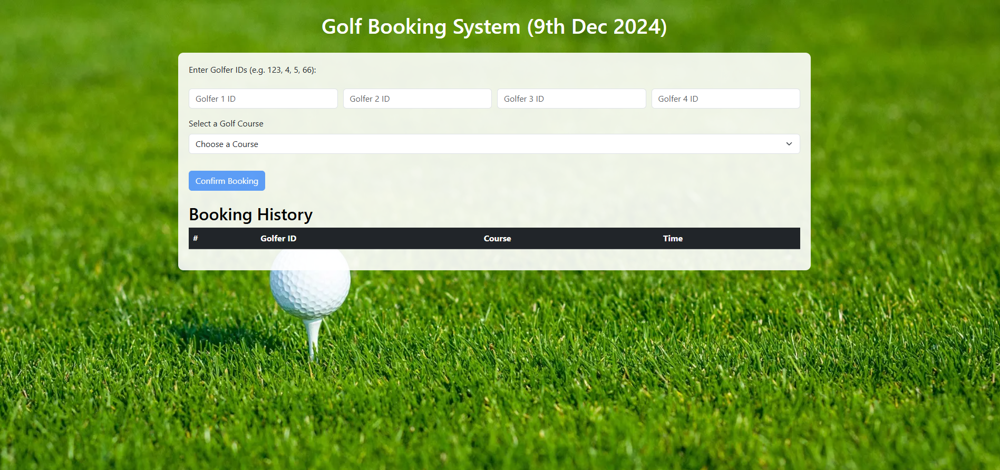

# AUTHOR - Sachin Bhopi - 9th Dec 2024

# Email Reference - Assignment for Front End Engineer Role X Golfbox | Sachin (sachin.bhopi92@gmail.com)

# Task -

    A golf club has introduced online booking for their 3 golf courses.
    On any given day, each golf course has available times starting from 7:00 AM to 7:00 PM, with 10-minute intervals, and each time slot can accommodate 4 golfers.
    A round of golf takes 5 hours, so a player should not be able to make a new booking if they already have one within 5 hours.

# Implementation -

Tech-stack used :
HTML, SCSS, JavaScript, Bootstrap framework(for UI classes), React js framework, redux toolkit, Vite, yarn, etc....

# Steps to run the project

step 1 - extract the project / pull from repo
step 2 - open terminal and do yarn install at folder "online-golf-booking-system"
step 3 - yarn run dev
step 4 - open browser and goto url http://localhost:5173/
step 5 - You can see attached form in browser window
step 6 - Fill the Golf Booking Form with details and hit Confirm Bookin button
step 7 - You can see booked history in the same form with Booking History.
step 8 - Validate all criteria and rules mentioned in assignment task
step 9 - This is pure UI code and used redux toolkit for storing the booking details as soon as page refreshed the data will be lost.
step 10 - For more live data it needs to be integrate with backend API and DB.
